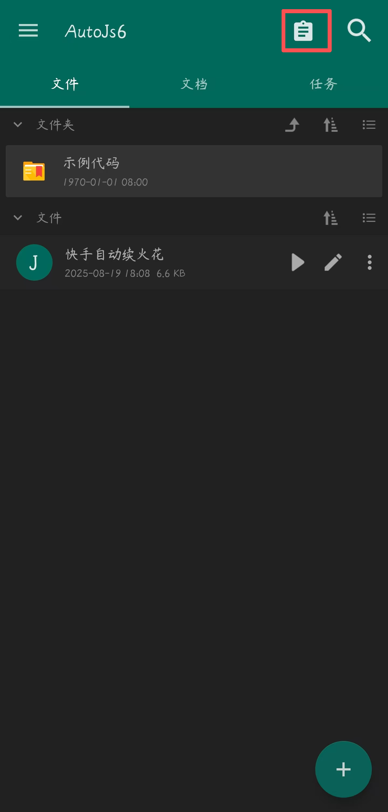

  

  

    
    
    
     
    
    
     
    
    
     
    
    
    <a href='https://gitee.com/COLDESTBOW30654/Automatic-spark-renewal-APP/stargazers'></img></a>
    <a href='https://gitee.com/COLDESTBOW30654/Automatic-spark-renewal-APP/members'></img></a>
  

### 项目官网：

[https://automation.hengduan.dpdns.org/](https://automation.hengduan.dpdns.org/)

### 前言:

本作品是基于[SuperMonster003/AutoJs6: 安卓平台 JavaScript 自动化工具 (Auto.js 二次开发项目)](https://github.com/SuperMonster003/AutoJs6)二次修改打包制作 Autojs6，并且将快手自动续火花脚本内置在应用中

快手自动续火花脚本项目地址：[[COLDESTBOW30654/Automatic-spark-renewal: 基于AutoJS6的快手自动续火花脚本]](https://www.bilibili.com/video/BV1zb3xzUEXj)

### 介绍:

bilibili 视频介绍：[快手自动续火花脚本-介绍](https://www.bilibili.com/video/BV11beMzNEgS)

### 软件架构：

- [AutoJs6](https://github.com/SuperMonster003/AutoJs6)

- JavaScript

### 环境：

- Android 操作系统
- [API](https://developer.android.com/guide/topics/manifest/uses-sdk-element#ApiLevels) [24](https://developer.android.com/reference/android/os/Build.VERSION_CODES#N) ([7.0](https://zh.wikipedia.org/wiki/Android_Nougat)) [[N](https://developer.android.com/reference/android/os/Build.VERSION_CODES#N)] 及以上

### 下载修改版 AutoJs6：

#### 在这里浏览最新构建(这里包含未发布的更新与版本)

[工作流程运行 ·COLDESTBOW30654/Automatic-spark-renewal-APP --- Workflow runs · COLDESTBOW30654/Automatic-spark-renewal-APP](https://github.com/COLDESTBOW30654/Automatic-spark-renewal-APP/actions)

#### 在这里浏览最新发布的版本(这里包含正式版与测试版)

- GitHub releases(需要加速器)

​	[Releases · COLDESTBOW30654/Automatic-spark-renewal-APP](https://github.com/COLDESTBOW30654/Automatic-spark-renewal-APP/releases)

- gitee releases(国内镜像)

​	[Automatic-spark-renewal-APP 发行版 - Gitee.com](https://gitee.com/coldestbow30654/Automatic-spark-renewal-APP/releases)

### 下载或复制代码：

请前往脚本原项目仓库下载或复制

[COLDESTBOW30654/Automatic-spark-renewal: 基于 AutoJS6 的快手自动续火花脚本](https://github.com/coldestbow30654/automatic-spark-renewal)

### 脚本所需权限:

#### 下列权限是需要给 Autojs 应用给予的权限，不给予可能导致脚本无法使用

1. 无障碍权限

2. 应用自启动

3. 后台无限制

4. 获取应用列表

5. 媒体音量控制

6. 后台弹出界面

7. 显示悬浮窗

8. 允许通知

9. 修改系统设置

**_其他非系统权限_**(根据你阅读的文档来判断是否需要给予，如果你手机本身开着自动熄屏且时间很短可不选)

- shizuku 权限
- Root 权限

### 注意事项：

1. 请勿同时运行多个重复脚本
2. 脚本运行过程中请勿进行任何操作
3. **测试使用版本**： 修改版 autojs 版本[(1.0.0)](https://pan.huang1111.cn/s/G8wD6sW) 快手版本[(13.7.30.43728)](https://pan.huang1111.cn/s/Wz33Pf3) 理论上支持所有快手版本，只要快手界面不进行特别大的改动都可以支持
4. 若新版本的脚本使用有问题，例如通过按钮名称自动寻找按钮位置点击无法生效，请尝试修改部分点击坐标的位置
5. 需将发送消息的方式修改为发送按键
6. 确保给予 shizuku 或 Root 权限

### 未来更新计划

| 计划             | 立项时间   | 完成时间   | 完成情况 | 描述                                                                                                               |
| ---------------- | ---------- | ---------- | -------- | ------------------------------------------------------------------------------------------------------------------ |
| 推出独立的应用   | 2025-09-20 | 2025-11-29 | ✓        | 将脚本内置在 autojs6 应用中                                                                                        |
| 多应用自动续火花 | 2025-09-12 | ✕          | ✕        |                                                                                                                    |
| 自动更新脚本     | 2025-09-12 | 2025-09-13 | ✓        | 无法通过通知跳转到更新网址，需要手动去日志里复制网址                                                               |
| 简化脚本使用条件 | 2025-09-12 | 2025-11-1  | ✓        | 通过项目网站进行构建，简化用户修改代码[(点击我跳转项目官网构建)](https://automation.hengduan.dpdns.org/build.html) |
| 适配更多安卓设备 | 2025-09-12 | ✕          | ✕        |                                                                                                                    |

### 问题反馈:

**如果你遇到脚本运行时产生的问题可以在以下提到的方式向我反馈**

1. 在快手平台向我提交私信

2. 在快手平台中我的相关视频评论

3. 在哔哩哔哩平台向我提交私信

4. 在哔哩哔哩平台中我的相关视频评论

5. 在 GitHub 中的脚本项目里提交 issue

   [Issues · COLDESTBOW30654/Automatic-spark-renewal](https://github.com/COLDESTBOW30654/Automatic-spark-renewal/issues)

6. 在 Gitee 中的脚本项目里提交 issue

   [Issues · 白鹿原嚒/automatic-spark-renewal](https://gitee.com/COLDESTBOW30654/Automatic-spark-renewal/issues)

7. 在 GitHub 中的AutoJS修改版项目里提交 issue

   [Issues · COLDESTBOW30654/Automatic-spark-renewal-APP](https://github.com/COLDESTBOW30654/Automatic-spark-renewal-APP/issues)

8. 在 Gitee 中的脚本项目里提交 issue

   [Issues · 白鹿原嚒/automatic-spark-renewal-APP](https://gitee.com/COLDESTBOW30654/Automatic-spark-renewal-APP/issues)

9. 发送邮件到我的邮箱：<EMAIL>automatic-spark-renewal@hengduan.dpdns.org

##### 在反馈时可以使用开发版[(点我跳转开发版)](/.code/快手自动续火花脚本-开发版.js)先运行一遍，然后向我反馈的时候附赠运行日志

点击展开或收起样例展示

   

       
      
   

### 常见问题回答：

Q: 我不会使用 shizuku，手机又没 root 怎么办？

A: **用懒人版，但目前稳定性低**

Q: 为什么脚本需要这么高的权限，有没有不需要高权限的版本？

A: 有的有的，去看懒人版，但目前稳定性低

Q: 为什么脚本要这么高的权限

A: 脚本需要的权限是模拟电源按键熄屏，如果没有这个权限，脚本将无法给手机熄屏，目前正在尝试使用第三方的“一键熄屏”但由于测试时，无法通过 app.launchApp 方法打开一键锁屏，估方法可能失效，又因为原作者的熄屏方式也无效，所以暂采取模拟电源按键熄屏的方式，需要 root 或 shizuku 权限，当然如果你手机开着自动熄屏且时长很短，可不给 shizuku 和 Root 权限，但我还是建议有 Root 的给 Root 权限，这样可以保证 Autojs 的软件无障碍一直存在

### 重要提示：

##### 在下载、安装或使用本脚本（以下简称“脚本”）之前，请您务必仔细阅读并充分理解[用户使用协议](LICENSE.md)的所有条款。您的下载、安装或使用行为即被视为您已完全阅读、理解并同意接受本协议的全部条款约束。如果您不同意本协议的任何内容，请立即停止使用并删除本脚本。

### 脚本更新历史

---

#### v1.0.0-alpha1

###### 2025/12/06

- `新增` 引入在线文档，将自动续火花脚本集成在内部