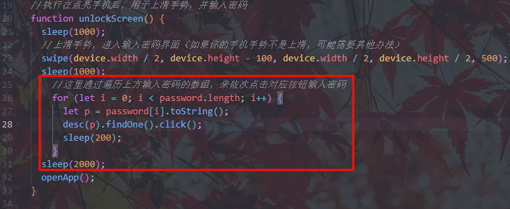
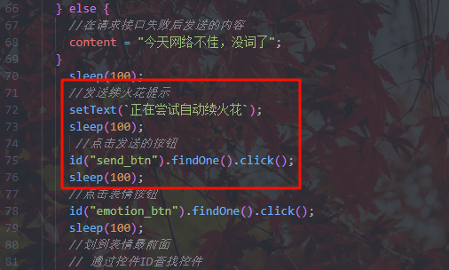
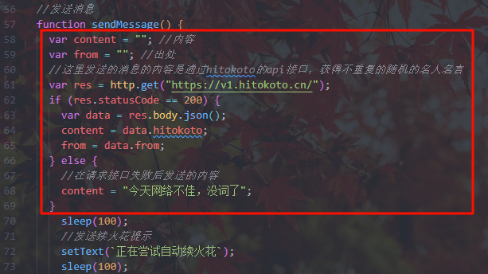
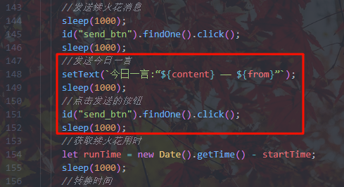

  
  

    
    
    
    
     
    
    
    <a href='https://gitee.com/COLDESTBOW30654/automatic-spark-renewal-APP/stargazers'></img></a>
    <a href='https://gitee.com/COLDESTBOW30654/automatic-spark-renewal-APP/members'></img></a>
  

### 项目官网：

[https://automation.hengduan.dpdns.org/](https://automation.hengduan.dpdns.org/)

### 前言:

脚本项目：[白鹿原嚒: 基于AutoJS6的快手自动续火花脚本](https://gitee.com/coldestbow30654/automatic-spark-renewal)

本作品包含的自动续火花脚本，基于[AutoJS6 抖音自动续火花](https://gitee.com/ewaaa/auto-js6-tiktok-auto-spark)二次修改并重新制作的快手自动续火花脚本

灵感来源：[LuckyLK](https://www.bilibili.com/video/BV1zb3xzUEXj)

### 介绍:

bilibili 视频介绍：[快手自动续火花脚本-介绍](https://www.bilibili.com/video/BV11beMzNEgS)

### 使用说明：

**看不懂可以用懒人版，但稳定性较差，不过不需要多余的软件，只要下载 Autojs6 即可**

[快手自动续火花脚本-懒人版(文字版教程)](.document/Document-Lazy.md)

代码都不想看？试试官网中的”脚本构建“功能吧

[点击我跳转项目官网](https://automation.hengduan.dpdns.org/build.html)

**您可以访问每个版本专属的文字版教程**

[快手自动续火花脚本-shizuku(文字版教程)](/使用教程-shizuku.md)
[快手自动续火花脚本-Root(文字版教程)](/使用教程-Root.md)

**如果以上文字版教程看不懂可以看视频版**

[快手自动自动续火花-教程(快手观看)](https://www.kuaishou.com/short-video/3xywczexb6t35cw)
[快手自动自动续火花-教程(哔哩哔哩观看)](https://www.bilibili.com/video/BV1J5Y9zEECi/)

### 软件架构：

[AutoJs6](https://github.com/SuperMonster003/AutoJs6)

JavaScript

### 脚本所需权限:

#### 下列权限是需要给 Autojs 应用给予的权限，不给予可能导致脚本无法使用

1. 无障碍权限

2. 应用自启动

3. 后台无限制

4. 获取应用列表

5. 媒体音量控制

6. 后台弹出界面

7. 显示悬浮窗

8. 允许通知

9. 修改系统设置

**_其他非系统权限_**(根据你阅读的文档来判断是否需要给予，如果你手机本身开着自动熄屏且时间很短可不选)

- shizuku 权限

### 下载或复制代码：

##### 这里不提供懒人版，懒人版在"懒人版文字教程"提供复制

两个版本本质上只是模拟熄屏按键的代码不同，也就是最后一行，如只使用无障碍权限授权，且开着手机自动熄屏时长比较短，可复制任意一种版本的代码，删除最后一行

**shizuku 版：**[快手自动续火花脚本-shizuku](../sample/快手自动续火花脚本-shizuku.js)

**Root 版：**[快手自动续火花脚本-Root](../sample/快手自动续火花脚本-Root.js)

**懒人版：**[懒人版文字教程](/使用教程-懒人版.html)

**开发版：**[快手自动续火花脚本-开发版](../sample//快手自动续火花脚本-开发版.js)

### 注意事项：

1. 如果你不需要使用密码打开手机，而是直接滑动解锁，请删除红色方框内的代码
2. 请勿同时运行多个重复脚本
3. 脚本运行过程中请勿进行任何操作
4. **测试使用版本**： autojs 版本[(6.6.4)](https://pan.huang1111.cn/s/byQ1qcY) 快手版本[(13.7.30.43728)](https://pan.huang1111.cn/s/Wz33Pf3) 理论上支持所有快手版本，只要快手界面不进行特别大的改动都可以支持
5. 若新版本的脚本使用有问题，例如通过按钮名称自动寻找按钮位置点击无法生效，请尝试修改部分点击坐标的位置
6. 需将发送消息的方式修改为发送按键
7. 确保给予 shizuku 或 Root 权限

### 未来更新计划

| 计划             | 立项时间   | 完成时间   | 完成情况 | 描述                                                         |
| ---------------- | ---------- | ---------- | -------- | ------------------------------------------------------------ |
| 推出独立的应用   | 2025-09-20 | 2025-11-29 | ✓        | 将脚本内置在autojs6应用中     *偷偷告诉你：关于界面被我改炸了*(。・ω・。) |
| 多应用自动续火花 | 2025-09-12 | ✕          | ✕        |                                                              |
| 自动更新脚本     | 2025-09-12 | 2025-09-13 | ✓        | 无法通过通知跳转到更新网址，需要手动去日志里复制网址         |
| 简化脚本使用条件 | 2025-09-12 | 2025-11-1  | ✓        | 通过项目网站进行构建，简化用户修改代码[(点击我跳转项目官网构建)](https://automation.hengduan.dpdns.org/build.html) |
| 适配更多安卓设备 | 2025-09-12 | ✕          | ✕        |                                                              |

### 问题反馈:

**如果你遇到脚本运行时产生的问题可以在以下提到的方式向我反馈**

1. 在快手平台向我提交私信

2. 在快手平台中我的相关视频评论

3. 在哔哩哔哩平台向我提交私信

4. 在哔哩哔哩平台中我的相关视频评论

5. 在 GitHub 中的项目里提交 issue

   [Issues · COLDESTBOW30654/Automatic-spark-renewal](https://github.com/COLDESTBOW30654/Automatic-spark-renewal/issues)

6. 在 Gitee 中的项目里提交 issue

   [Issues · 白鹿原嚒/automatic-spark-renewal](https://gitee.com/coldestbow30654/automatic-spark-renewal/issues)

7. 发送邮件到我的邮箱：<EMAIL>automatic-spark-renewal@hengduan.dpdns.org

##### 在反馈时可以使用开发版[(点我跳转开发版)](/.code/快手自动续火花脚本-开发版.js)先运行一遍，然后向我反馈的时候附赠运行日志

点击展开或收起样例展示

   

       
      
   

### 常见问题回答：

Q: autojs 如何下载安装使用？

A: 这个你可以去查相关教程，都特别详细，简直是保姆级教程。

Q: 这个脚本可以给多个人发送消息吗？

A: 暂未测试

Q: 支持平板吗？

A: 理论上支持所有设备，但条件有限暂未测试

Q: 脚本发送的内容可以自定义吗？

A: 你可以根据下列图片来修改部分脚本发送的文本

这里修改发送的第一句

删除这里关闭自动续火花提示

这里修改发送的一言，删除后不会输出一言，但还会发送原始变量

删除这里彻底关闭一言

删除这里关闭续火花时长告知对方

Q: 如何知道我手机点击位置的坐标？

A: 开发者模式，打开显示坐标功能，具体步骤可以自己查询。

Q: 我不会使用 shizuku，手机又没 root 怎么办？

A: **用懒人版，但目前稳定性低**

Q: 为什么脚本需要这么高的权限，有没有不需要高权限的版本？

A: 有的有的，去看懒人版，但目前稳定性低

Q: 为什么脚本要这么高的权限

A: 脚本需要的权限是模拟电源按键熄屏，如果没有这个权限，脚本将无法给手机熄屏，目前正在尝试使用第三方的“一键熄屏”但由于测试时，无法通过 app.launchApp 方法打开一键锁屏，估方法可能失效，又因为原作者的熄屏方式也无效，所以暂采取模拟电源按键熄屏的方式，需要 root 或 shizuku 权限，当然如果你手机开着自动熄屏且时长很短，可不给 shizuku 和 Root 权限，但我还是建议有 Root 的给 Root 权限，这样可以保证 Autojs 的软件无障碍一直存在

### 重要提示：

##### 在下载、安装或使用本脚本（以下简称“脚本”）之前，请您务必仔细阅读并充分理解[用户使用协议](./LICENSE.html)的所有条款。您的下载、安装或使用行为即被视为您已完全阅读、理解并同意接受本协议的全部条款约束。如果您不同意本协议的任何内容，请立即停止使用并删除本脚本。

### 仓库与脚本更新历史

---

#### v1.0.0

###### 2025/09/13

- `新增` 自动检查更新逻辑

#### v0.2.0

###### 2025/09/13

- `新增` 快手自动续火花脚本-开发版-Beta.js
- `新增` 自动检查更新逻辑

#### v0.1.4

###### 2025/09/07

- `新增` README 问题反馈板块
- `新增` 快手自动续火花脚本-开发版.js

#### v0.1.3

###### 2025/09/05

- `优化` 格式化仓库文件

#### v0.1.2

###### 2025/08/24

- `新增` Document.md
- `新增` 快手自动续火花脚本-懒人版-无密码.js
- `新增` 快手自动续火花脚本-懒人版-有密码.js
- `优化` README.md
- `优化` 文字版教程

#### v0.1.1

###### 2025/08/24

- `转移` Document-Root.md
- `转移` Document-shizuku.md
- `优化` README.md
- `优化` 文字版教程

#### v0.1.0

###### 2025/08/23

- `新增` Document-Root.md
- `新增` Document-shizuku.md
- `转移` 将图片位置转移至 photo 文件夹

#### v0.0.2

###### 2025/08/22

- `优化` README 界面的使用教程

#### v0.0.1

###### 2025/08/19

- `新增` 快手自动续火花脚本-shizuku.js
- `新增` 快手自动续火花脚本-Root.js
- `新增` LICENSE.md
